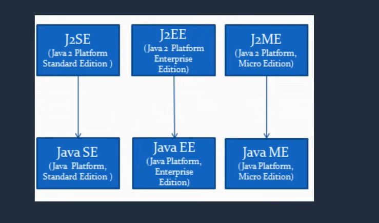
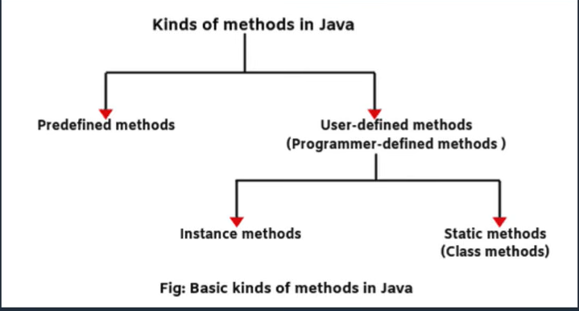

# Java_Learn

## Mục lục

1. [Tổng quan các module trong khóa học Java](#1-tổng-quan-các-module-trong-khóa-học-java)
   - [1. Java SE (Standard Edition)](#1-java-se-standard-edition)
   - [2. Java EE / Jakarta EE](#2-java-ee--jakarta-ee)
   - [3. Build Tools & Technologies](#3-build-tools--technologies)
   - [Luồng học tập đề xuất](#luồng-học-tập-đề-xuất)
   - [Tổng kết](#tổng-kết)
2. [Quy trình lập trình cơ bản](#2-quy-trình-lập-trình-cơ-bản)
   - [1. Problem Analysis (Phân tích bài toán)](#1-problem-analysis-phân-tích-bài-toán)
   - [2. Algorithm Design (Thiết kế thuật toán)](#2-algorithm-design-thiết-kế-thuật-toán)
   - [3. Flowchart (Sơ đồ khối)](#3-flowchart-sơ-đồ-khối)
   - [4. Program (Viết chương trình)](#4-program-viết-chương-trình)
   - [5. Result (Kết quả)](#5-result-kết-quả)
   - [Tóm tắt quy trình](#tóm-tắt-quy-trình)

---

## 1. Tổng quan các module trong khóa học Java

Dưới đây là sơ đồ tổng quan các module chính được đề cập trong khóa học Java:



Sơ đồ trên thể hiện cấu trúc và mối quan hệ giữa các module trong khóa học **Java**. Dưới đây là giải thích chi tiết từng phần:

---

### 1. Java SE (Standard Edition)

Phần nền tảng và cốt lõi của ngôn ngữ Java, bao gồm:

- **Java Core** – Các kiến thức nền tảng: cú pháp, OOP, collections, exception handling, generics, lambda, streams...
- **Java Database** – Kết nối và thao tác cơ sở dữ liệu với JDBC.
- **Java Input/Output (IO)** – Xử lý nhập/xuất dữ liệu: đọc/ghi file, stream.
- **Java Networking** – Lập trình mạng: socket, HTTP request, REST API client.
- **Java Concurrency** – Xử lý đa luồng (multithreading), đồng bộ hóa (synchronization).
- **Java Security** – Bảo mật trong Java: mã hóa, xác thực, quản lý quyền truy cập.

---

### 2. Java EE / Jakarta EE

Nền tảng phát triển ứng dụng doanh nghiệp, bao gồm:

- **Java Web** – Phát triển ứng dụng web: Servlets, JSP, JSTL, Filters, Listeners.
- **Java Frameworks** – Các framework phổ biến:
  - **Spring Framework** – IoC, AOP, Spring MVC, Spring Boot, Spring Data...
  - **Hibernate** – ORM (Object-Relational Mapping) để tương tác với database.
- **Java Web Services** – Xây dựng và sử dụng dịch vụ web:
  - **SOAP Web Services** – Dịch vụ web dựa trên giao thức SOAP.
  - **RESTful Web Services** – Dịch vụ web RESTful sử dụng HTTP và JSON/XML.

---

### 3. Build Tools & Technologies

Các công cụ hỗ trợ quản lý project và build:

- **Maven** – Công cụ quản lý project, dependency, build và automation.
- **Gradle** – Công cụ build hiện đại, linh hoạt, được sử dụng rộng rãi với Android và Spring Boot.
- **Ant** – Công cụ build truyền thống, ít được sử dụng trong các project hiện đại.

---

### Luồng học tập đề xuất

```
Java SE (Core)
    │
    ├──► Java Database (JDBC)
    │
    ├──► Java IO & Networking
    │
    └──► Java Concurrency & Security
            │
            ▼
    Java EE / Jakarta EE
            │
            ├──► Java Web (Servlet/JSP)
            │
            ├──► Java Frameworks (Spring, Hibernate)
            │
            └──► Java Web Services (REST, SOAP)
```

---

### Tổng kết

| Module | Mục tiêu |
|---|---|
| **Java SE** | Nền tảng vững chắc về ngôn ngữ Java và các thư viện chuẩn |
| **Java EE** | Phát triển ứng dụng doanh nghiệp, web, dịch vụ |
| **Build Tools** | Quản lý project và quy trình build chuyên nghiệp |

---

## Quy trình lập trình cơ bản

Sơ đồ dưới đây thể hiện quy trình cơ bản khi giải quyết một bài toán lập trình:



Quy trình gồm **5 bước** tuần tự, mỗi bước đóng vai trò quan trọng trong việc xây dựng một chương trình hoàn chỉnh:

### 1. Problem Analysis (Phân tích bài toán)

- **Mục tiêu:** Hiểu rõ yêu cầu của bài toán
- **Nội dung:** Xác định đầu vào (input), đầu ra (output), các ràng buộc và điều kiện của bài toán
- **Ví dụ:** Bài toán "Tính tổng 2 số nguyên" → Input: 2 số nguyên; Output: tổng 2 số

### 2. Algorithm Design (Thiết kế thuật toán)

- **Mục tiêu:** Xây dựng các bước logic để giải quyết bài toán
- **Phương pháp:** Sử dụng ngôn ngữ tự nhiên, sơ đồ khối (flowchart), hoặc mã giả (pseudocode)
- **Ví dụ:** Bước 1: Nhập số A; Bước 2: Nhập số B; Bước 3: Tính tổng = A + B; Bước 4: In kết quả

### 3. Flowchart (Sơ đồ khối)

- **Mục tiêu:** Trực quan hóa thuật toán bằng các ký hiệu đồ họa
- **Các ký hiệu phổ biến:**
  - **Oval** – Bắt đầu / Kết thúc (Start / End)
  - **Hình chữ nhật** – Xử lý / Phép toán (Process)
  - **Hình thoi** – Rẽ nhánh / Điều kiện (Decision)
  - **Mũi tên** – Luồng xử lý (Flow direction)
- **Ưu điểm:** Dễ hiểu, không phụ thuộc ngôn ngữ lập trình, giúp phát hiện lỗi logic trước khi viết code

### 4. Program (Viết chương trình)

- **Mục tiêu:** Chuyển thuật toán thành mã nguồn trong ngôn ngữ lập trình (ví dụ: Java)
- **Các bước thực hiện:**
  - Khai báo biến và kiểu dữ liệu phù hợp
  - Viết logic xử lý theo thuật toán đã thiết kế
  - Thêm xử lý ngoại lệ (exception handling)
  - Tối ưu code (nếu cần)
- **Ví dụ (Java):**
  ```java
  public class SumTwoNumbers {
      public static void main(String[] args) {
          int a = 5;
          int b = 3;
          int sum = a + b;
          System.out.println("Tong = " + sum);
      }
  }
  ```

### 5. Result (Kết quả)

- **Mục tiêu:** Xác nhận chương trình hoạt động đúng
- **Kiểm tra:** Chạy chương trình với các bộ dữ liệu thử nghiệm (test cases) để đảm bảo kết quả đầu ra chính xác
- **Debug:** Sửa lỗi nếu kết quả không đúng mong đợi

---

### Tóm tắt quy trình

```
┌─────────────────────┐
│  1. Problem Analysis │  ← Hiểu bài toán
└──────────┬──────────┘
           ▼
┌─────────────────────┐
│  2. Algorithm Design │  ← Xây dựng thuật toán
└──────────┬──────────┘
           ▼
┌─────────────────────┐
│     3. Flowchart     │  ← Vẽ sơ đồ khối
└──────────┬──────────┘
           ▼
┌─────────────────────┐
│     4. Program       │  ← Viết mã nguồn
└──────────┬──────────┘
           ▼
┌─────────────────────┐
│      5. Result       │  ← Kiểm tra kết quả
└─────────────────────┘
```

> **Ghi chú:** Hình ảnh được chèn tại đường dẫn `./public/assets/flow_basic.png`. Đảm bảo thư mục `public/assets/` chứa file hình ảnh để hiển thị đúng trên trình duyệt web.
