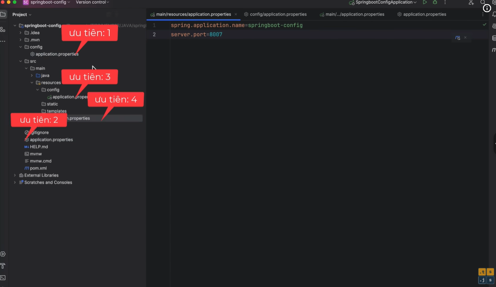

# Spring Boot Configuration File Priority

Thứ tự ưu tiên các file cấu hình trong Spring Boot (từ **cao nhất** đến **thấp nhất**):

| Priority | Nguồn cấu hình | Mô tả |
|:--------:|----------------|-------|
| 1 | **Command Line Arguments** (`--spring.config.location=...`) | Tham số truyền qua dòng lệnh khi chạy ứng dụng |
| 2 | **SPRING_APPLICATION_JSON** | Biến môi trường chứa JSON (`SPRING_APPLICATION_JSON`) |
| 3 | **JNDI** | Thuộc tính từ Java Naming and Directory Interface |
| 4 | **OS Environment Variables** | Biến môi trường hệ điều hành |
| 5 | **RandomValuePropertySource** | Giá trị sinh ngẫu nhiên (`${random.int}`, `${random.uuid}`, ...) |
| 6 | **Jar外特定配置文件** (`classpath:/config/`) | File cấu hình profile cụ thể bên ngoài JAR, đặt trong thư mục `/config` |
| 7 | **Jar外默认配置文件** (`classpath:/`) | File cấu hình mặc định bên ngoài JAR, đặt ở root classpath |
| 8 | **Jar内特定配置文件** (`application-{profile}.properties`) | File cấu hình cho profile cụ thể bên trong JAR (e.g. `application-dev.properties`) |
| 9 | **Jar内默认配置文件** (`application.properties`) | File cấu hình mặc định bên trong JAR |
| 10 | **@PropertySource** | Annotation trên class `@Configuration` để load file `.properties` |
| 11 | **SpringApplication.setDefaultProperties** | Cấu hình mặc định đặt trong code (programmatic) |

## Nguyên tắc áp dụng

- **Cấu hình sau ghi đè cấu hình trước** — cùng một property, giá trị ở dòng cao hơn (số thấp hơn) sẽ được ưu tiên.
- **Profile-specific** luôn ghi đè **default** — e.g. `application-dev.properties` ghi đè `application.properties`.
- **Bên ngoài JAR** (filesystem) luôn ghi đè **bên trong JAR** (classpath) — cho phép override mà không cần repackage.

## Ví dụ thực tế

```bash
# Ưu tiên cao nhất: command line argument
java -jar app.jar --spring.datasource.url=jdbc:mysql://prod:3306/mydb
```

```properties
# SPRING_APPLICATION_JSON (ưu tiên 2)
# Set qua biến môi trường:
export SPRING_APPLICATION_JSON='{"spring":{"datasource":{"url":"jdbc:mysql://prod:3306/mydb"}}}'
```

## Tham khảo


