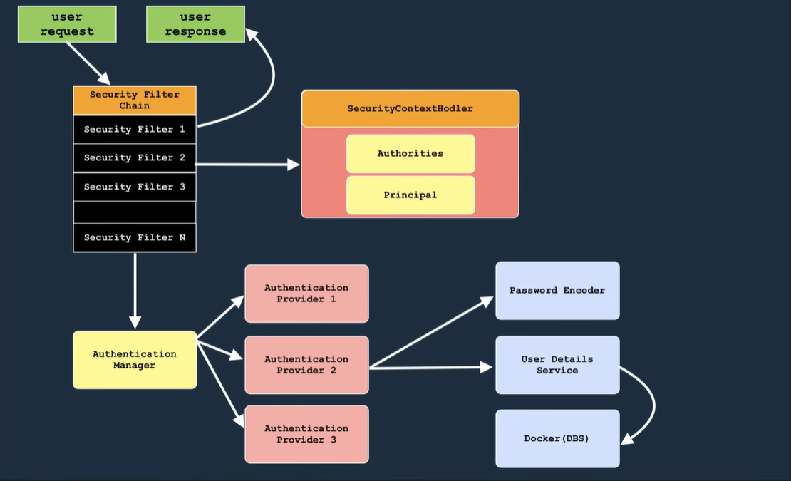

# Spring Security

## Mục lục

1. [Sơ đồ luồng xác thực](#sơ-đồ-luồng-xác-thực-request-trong-spring-security)
2. [Giải thích chi tiết từng thành phần](#giải-thích-chi-tiết-từng-thành-phần)
   - [1. User Request → Security Filter Chain](#1-user-request--security-filter-chain)
   - [2. SecurityContextHolder](#2-securitycontextholder)
   - [3. Authentication Manager](#3-authentication-manager)
   - [4. Authentication Provider (1, 2, 3)](#4-authentication-provider-1-2-3)
   - [5. Password Encoder](#5-password-encoder)
   - [6. User Details Service](#6-user-details-service)
   - [7. Docker (DBS)](#7-docker-dbs)
3. [Luồng xác thực tổng hợp](#luồng-xác-thực-tổng-hợp)
4. [Code mẫu SecurityConfig](#code-mẫu-securityconfig)
5. [Các phương thức xác thực](#các-phương-thức-xác-thực-authentication-methods)
   - [1. Basic Authentication](#1-basic-authentication)
   - [2. Digest Authentication](#2-digest-authentication)
   - [3. SSL Client Authentication](#3-ssl-client-authentication-x509-certificate)
   - [4. Form-based Authentication](#4-form-based-authentication)
   - [So sánh 4 phương thức](#so-sánh-4-phương-thức-xác-thực)
6. [Bảng tổng hợp màu sắc sơ đồ](#bảng-tổng-hợp-màu-sắc-sơ-đồ)

---

## Sơ đồ luồng xác thực request trong Spring Security



```
┌──────────────────┐
│   USER REQUEST   │  (green)
└────────┬─────────┘
         │
         ▼
┌───────────────────────────────────┐
│      SECURITY FILTER CHAIN        │  (black / orange header)
│  ┌─────────────────────────────┐  │
│  │   Security Filter 1         │  │
│  ├─────────────────────────────┤  │
│  │   Security Filter 2         │  │
│  ├─────────────────────────────┤  │
│  │   Security Filter 3         │  │
│  ├─────────────────────────────┤  │
│  │            ...              │  │
│  ├─────────────────────────────┤  │
│  │   Security Filter N         │  │
│  └─────────────────────────────┘  │
└────────┬────────────┬──────────────┘
         │            │
         ▼            ▼
┌────────────────┐    ┌─────────────────────────────────┐
│   USER         │    │      SECURITY CONTEXT HOLDER    │  (red/pink)
│   RESPONSE     │    │  ┌────────────┐ ┌────────────┐  │
│   (green)      │    │  │ Authorities│ │ Principal │  │
└────────────────┘    │  └────────────┘ └────────────┘  │
                      └─────────────────────────────────┘
         │
         ▼
┌──────────────────────────────────────────┐
│         AUTHENTICATION MANAGER            │  (yellow)
└────────┬─────────┬──────────┬───────────┘
         │         │          │
         ▼         ▼          ▼
┌───────────┐ ┌───────────┐ ┌───────────┐
│  Provider │ │  Provider │ │  Provider │
│     1     │ │     2     │ │     3     │  (pink)
└───────────┘ └─────┬─────┘ └───────────┘
                    │
        ┌───────────┴───────────┐
        │                       │
        ▼                       ▼
┌─────────────────┐  ┌──────────────────────┐
│ Password Encoder │  │  User Details Svc   │  (light blue)
└─────────────────┘  └──────────┬───────────┘
                                 │
                                 ▼
                          ┌─────────────┐
                          │ Docker (DBS)│  (light blue)
                          └─────────────┘
```

## Giải thích chi tiết từng thành phần

### 1. User Request → Security Filter Chain

```
User Request  ──▶  Security Filter Chain
                        │
                        ├── Security Filter 1  (kiểm tra đầu tiên)
                        ├── Security Filter 2
                        ├── Security Filter 3
                        ├── ...
                        └── Security Filter N
```

- **User Request**: Yêu cầu từ phía người dùng gửi lên server (chưa xác thực).
- **Security Filter Chain**: Chuỗi các bộ lọc bảo mật được thực thi **theo thứ tự**. Mỗi filter đảm nhận một nhiệm vụ riêng.
  - Một số filter phổ biến:
    - `SecurityContextPersistenceFilter` — Lưu/khôi phục SecurityContext qua request
    - `LogoutFilter` — Xử lý logout
    - `UsernamePasswordAuthenticationFilter` — Thu thập thông tin đăng nhập (username/password)
    - `FilterSecurityInterceptor` — Kiểm tra quyền truy cập cuối cùng
- Sau khi filter chain xử lý xong, luồng rẽ hai hướng:
  1. **SecurityContextHolder** — lưu trữ context (Principal + Authorities)
  2. **Authentication Manager** — xử lý xác thực

### 2. SecurityContextHolder

```
┌─────────────────────────────────┐
│       SECURITY CONTEXT HOLDER   │
│  ┌────────────┐ ┌────────────┐ │
│  │ Authorities│ │ Principal  │ │
│  └────────────┘ └────────────┘ │
└─────────────────────────────────┘
```

- Lưu trữ thông tin bảo mật của người dùng **sau khi xác thực thành công**.
- **Principal**: Tên người dùng (username) hoặc đối tượng user details.
- **Authorities**: Danh sách quyền/role của người dùng (ví dụ: `ROLE_USER`, `ROLE_ADMIN`).
- Được lưu trong `SecurityContext`, và có thể truy cập ở bất kỳ đâu trong ứng dụng qua:
  ```java
  SecurityContextHolder.getContext().getAuthentication()
  ```

### 3. Authentication Manager

```
Security Filter Chain  ──▶  Authentication Manager
                              │
                  ┌───────────┼───────────┐
                  ▼           ▼           ▼
             Provider 1   Provider 2   Provider 3
```

- **Authentication Manager**: Giao diện trung tâm điều phối việc xác thực.
- Ủy quyền (delegate) việc xác thực cho một hoặc nhiều **Authentication Provider**.
- Phương thức chính: `Authentication authenticate(Authentication request)`

### 4. Authentication Provider (1, 2, 3)

- Mỗi provider thực hiện một **logic xác thực cụ thể**:
  - `DaoAuthenticationProvider` — xác thực bằng database (dùng `UserDetailsService`)
  - `JwtAuthenticationProvider` — xác thực bằng JWT token
  - `OAuth2AuthenticationProvider` — xác thực qua OAuth2 (Google, GitHub...)
  - `LdapAuthenticationProvider` — xác thực qua LDAP
- Provider 2 (trong sơ đồ) tương tác với:
  1. **Password Encoder** — mã hóa / so sánh mật khẩu
  2. **User Details Service** — tải thông tin người dùng

### 5. Password Encoder

- Chịu trách nhiệm **mã hóa mật khẩu** và **kiểm tra mật khẩu**.
- Các loại phổ biến:
  - `BCryptPasswordEncoder` — thuật toán BCrypt (**khuyến nghị**)
  - `NoOpPasswordEncoder` — không mã hóa (test)
  - `StandardStringPasswordEncoder` — SHA-256
- Ví dụ sử dụng:
  ```java
  // Mã hóa
  String encoded = passwordEncoder.encode("myPassword");

  // Kiểm tra
  boolean matches = passwordEncoder.matches("myPassword", encodedHash);
  ```

### 6. User Details Service

- Giao diện tải thông tin người dùng từ **database** hoặc nguồn khác.
- Phương thức chính: `UserDetails loadUserByUsername(String username)`
- Tương tác với **Docker (DBS)** (database) để truy vấn thông tin người dùng.
- Ví dụ:
  ```java
  @Service
  public class CustomUserDetailsService implements UserDetailsService {

      @Autowired
      private UserRepository userRepository;

      @Override
      public UserDetails loadUserByUsername(String username)
              throws UsernameNotFoundException {
          User user = userRepository.findByUsername(username)
              .orElseThrow(() -> new UsernameNotFoundException(...));
          return user;
      }
  }
  ```

### 7. Docker (DBS)

- Hệ thống database lưu trữ thông tin người dùng (username, password đã mã hóa, roles...).
- `User Details Service` truy vấn database để lấy dữ liệu phục vụ xác thực.

---

## Luồng xác thực tổng hợp

```
1.  User Request
        │
        ▼
2.  Security Filter Chain
        │  (filter 1 → filter 2 → filter 3 → ... → filter N)
        ▼
3a. SecurityContextHolder  ◄── lưu Principal + Authorities
        │
3b. Authentication Manager  ◄── ủy quyền xác thực
        │
        ▼
4.  Authentication Provider (1 / 2 / 3)
        │
        ├── Password Encoder ──── kiểm tra mật khẩu
        │
        └── User Details Service ──── truy vấn DB
                 │
                 ▼
           Docker (DBS)
                 │
        (trả về UserDetails)
                 │
        ▼
5.  Xác thực thành công → SecurityContextHolder (Principal + Authorities)
                 │
                 ▼
6.  User Response
```

---

## Code mẫu SecurityConfig

```java
@Configuration
@EnableWebSecurity
public class SecurityConfig {

    @Bean
    public SecurityFilterChain filterChain(HttpSecurity http) throws Exception {
        http
            .authorizeHttpRequests(auth -> auth
                .requestMatchers("/public/**").permitAll()
                .requestMatchers("/admin/**").hasRole("ADMIN")
                .anyRequest().authenticated()
            )
            .formLogin(form -> form
                .loginPage("/login")
                .permitAll()
            )
            .logout(logout -> logout.permitAll());

        return http.build();
    }

    @Bean
    public UserDetailsService userDetailsService() {
        UserDetails user = User.builder()
            .username("user")
            .password(passwordEncoder().encode("password"))
            .roles("USER")
            .build();
        return new InMemoryUserDetailsManager(user);
    }

    @Bean
    public PasswordEncoder passwordEncoder() {
        return new BCryptPasswordEncoder();
    }
}
```

---

## Các phương thức xác thực (Authentication Methods)

### 1. Basic Authentication

Xác thực HTTP Basic — gửi thông tin đăng nhập qua **header** `Authorization`.

**Cơ chế:**
- Client gửi request kèm header:
  ```
  Authorization: Basic base64(username:password)
  ```
- Server giải mã Base64 → lấy username/password → so sánh với database.
- Nếu đúng → cho phép truy cập; sai → trả về `401 Unauthorized` + header `WWW-Authenticate: Basic`.

**Ưu điểm:** Đơn giản, hỗ trợ rộng rãi (trình duyệt, HTTP client, curl...).

**Nhược điểm:** Username/password gửi dưới dạng Base64 (**không mã hóa**). → Phải dùng qua **HTTPS** để đảm bảo bảo mật.

**Cấu hình trong Spring Security:**

```java
@Configuration
@EnableWebSecurity
public class SecurityConfig {

    @Bean
    public SecurityFilterChain filterChain(HttpSecurity http) throws Exception {
        http
            .authorizeHttpRequests(auth -> auth
                .anyRequest().authenticated()
            )
            .httpBasic(httpBasic -> {});          // ← bật Basic Auth
        return http.build();
    }
}
```

**Dùng với Postman / curl:**
```bash
curl -u username:password http://localhost:8080/api/resource
```

---

### 2. Digest Authentication

Xác thực HTTP Digest — cải tiến hơn Basic, **không gửi mật khẩu dạng plain text**.

**Cơ chế:**
1. Client gửi request **không có** thông tin xác thực.
2. Server phản hồi `401 Unauthorized` + header `WWW-Authenticate: Digest` kèm **nonce** (chuỗi ngẫu nhiên server-side) và **realm** (vùng xác thực).
3. Client tính toán **hash** từ:
   ```
   hash(username : realm : password) + nonce + HTTP method + URI
   ```
   → gửi kết quả lên server dưới dạng `Authorization: Digest ...`
4. Server kiểm tra hash → xác thực thành công hoặc thất bại.

**Ưu điểm:** Mật khẩu không gửi trực tiếp qua mạng, chống replay attack (nhờ nonce).

**Nhược điểm:**
- Phức tạp hơn Basic Auth.
- Cần server lưu mật khẩu dạng **plain text hoặc MD5** (để tính hash) → kém bảo mật hơn khi database bị lộ.
- Hầu hết trình duyệt **không hỗ trợ tốt**.

**Cấu hình trong Spring Security:**

```java
@Configuration
@EnableWebSecurity
public class SecurityConfig {

    @Bean
    public SecurityFilterChain filterChain(HttpSecurity http) throws Exception {
        http
            .authorizeHttpRequests(auth -> auth
                .anyRequest().authenticated()
            )
            .digestAuthentication(digest -> {});   // ← bật Digest Auth
        return http.build();
    }
}
```

---

### 3. SSL Client Authentication (X.509 Certificate)

Xác thực bằng **chứng chỉ số (certificate)** phía client — còn gọi là **mutual TLS (mTLS)**.

**Cơ chế:**
1. Server có **SSL/TLS certificate** (chứng chỉ phía server).
2. Client cũng có **X.509 certificate** (chứng chỉ phía client) được cấp phát trước.
3. Khi handshake TLS:
   - Server gửi certificate → client xác minh (để xác thực **server**).
   - Client gửi certificate → server xác minh (để xác thực **client**).
4. Nếu certificate hợp lệ → kết nối được thiết lập → user được xác thực dựa trên **DN (Distinguished Name)** trong certificate.

**Ưu điểm:**
- Rất bảo mật — không cần password.
- Không thể giả mạo certificate (dựa trên PKI).
- Phù hợp cho **microservices**, **IoT**, **doanh nghiệp** (B2B).

**Nhược điểm:**
- Cần infrastructure PKI (Public Key Infrastructure).
- Phát hành và quản lý certificate phức tạp.
- Không thuận tiện cho người dùng cuối (end-user).

**Cấu hình trong Spring Security:**

```java
@Configuration
@EnableWebSecurity
public class SecurityConfig {

    @Bean
    public SecurityFilterChain filterChain(HttpSecurity http) throws Exception {
        http
            .authorizeHttpRequests(auth -> auth
                .requestMatchers("/public/**").permitAll()
                .anyRequest().authenticated()
            )
            .x509(x509 -> x509
                .subjectPrincipalRegex("CN=(.*)")   // ← extract username từ certificate DN
                .userDetailsService(userDetailsService())
            );
        return http.build();
    }

    @Bean
    public UserDetailsService userDetailsService() {
        // Load user từ certificate CN
        return username -> User.builder()
            .username(username)
            .password("")       // không cần password vì đã xác thực qua certificate
            .roles("USER")
            .build();
    }
}
```

**Cấu hình SSL trong `application.properties`:**
```properties
server.ssl.enabled=true
server.ssl.key-store=classpath:keystore.p12
server.ssl.key-store-password=changeit
server.ssl.key-store-type=PKCS12
server.ssl.client-auth=need        # need = bắt buộc, want = khuyến khích
server.ssl.trust-store=classpath:truststore.p12
server.ssl.trust-store-password=changeit
```

---

### 4. Form-based Authentication

Xác thực bằng **form HTML** do ứng dụng web sinh ra.

**Cơ chế:**
1. User truy cập trang cần xác thực → server redirect đến **trang login** (`/login`).
2. User nhập username/password → gửi **POST** request đến `/login`.
3. `UsernamePasswordAuthenticationFilter` thu thập thông tin → gọi `AuthenticationManager`.
4. `AuthenticationProvider` (thường là `DaoAuthenticationProvider`) kiểm tra:
   - `UserDetailsService.loadUserByUsername()` → lấy user từ DB.
   - `PasswordEncoder.matches()` → so sánh mật khẩu.
5. Thành công → lưu vào `SecurityContext` → redirect đến trang ban đầu.
6. Thất bại → redirect đến `/login?error`.

**Ưu điểm:**
- Giao diện người dùng tùy chỉnh được (custom login page).
- Dễ tích hợp CAPTCHA, "Remember Me", social login...
- Phổ biến nhất cho ứng dụng web thông thường.

**Nhược điểm:**
- Phụ thuộc trình duyệt / HTML form.
- Cần bảo vệ trang login khỏi brute-force attack.

**Cấu hình trong Spring Security:**

```java
@Configuration
@EnableWebSecurity
public class SecurityConfig {

    @Bean
    public SecurityFilterChain filterChain(HttpSecurity http) throws Exception {
        http
            .authorizeHttpRequests(auth -> auth
                .requestMatchers("/login", "/css/**", "/js/**").permitAll()
                .requestMatchers("/admin/**").hasRole("ADMIN")
                .anyRequest().authenticated()
            )
            .formLogin(form -> form
                .loginPage("/login")           // trang login tùy chỉnh
                .loginProcessingUrl("/login")  // URL xử lý POST
                .defaultSuccessUrl("/home", true)
                .failureUrl("/login?error")
                .usernameParameter("username")
                .passwordParameter("password")
                .permitAll()
            )
            .logout(logout -> logout
                .logoutUrl("/logout")
                .logoutSuccessUrl("/login?logout")
                .permitAll()
            );
        return http.build();
    }
}
```

**Template HTML (JSP / Thymeleaf):**
```html
<!-- Thymeleaf -->
<form th:action="@{/login}" method="post">
    <div th:if="${param.error}">Sai tài khoản hoặc mật khẩu</div>
    <div th:if="${param.logout}">Đã đăng xuất</div>

    <input type="text" name="username" placeholder="Username" required />
    <input type="password" name="password" placeholder="Password" required />
    <button type="submit">Đăng nhập</button>
</form>
```

---

## So sánh 4 phương thức xác thực

| Tiêu chí | Basic Auth | Digest Auth | SSL Client Auth | Form-based Auth |
|---|---|---|---|---|
| **Thông tin gửi đi** | Base64 (username:pass) | MD5/SHA hash | X.509 Certificate | Username/password POST |
| **Mã hóa** | Không (cần HTTPS) | Hash (không gửi plain text) | Mã hóa TLS | Không (cần HTTPS) |
| **Bảo mật** | Thấp | Trung bình | Rất cao | Trung bình |
| **Độ phức tạp** | Đơn giản | Trung bình | Phức tạp (PKI) | Đơn giản |
| **Phạm vi sử dụng** | API / CLI / Test | Ít phổ biến | Doanh nghiệp / Microservices | Ứng dụng web |
| **User experience** | Hộp thoại trình duyệt | Hộp thoại trình duyệt | Tự động (cert) | Trang login tùy chỉnh |
| **Cần server setup** | Không | Không | SSL Certificate | Không |
| **Chống replay attack** | Không | Có (nhờ nonce) | Có (TLS) | Không (cần thêm) |

---

## Bảng tổng hợp màu sắc sơ đồ

| Màu | Thành phần | Vai trò |
|---|---|---|
| 🟢 Xanh lá | User Request / Response | Điểm đầu vào và đầu ra của luồng |
| 🟠 Cam / ⬛ Đen | Security Filter Chain | Chuỗi bộ lọc bảo mật |
| 🔴 Đỏ / 🩷 Hồng | SecurityContextHolder | Lưu Principal + Authorities |
| 🟡 Vàng | Authentication Manager | Điều phối xác thực |
| 🩷 Hồng | Authentication Provider (1, 2, 3) | Thực hiện logic xác thực |
| 🔵 Xanh dương nhạt | Password Encoder, User Details Service, Docker (DBS) | Dịch vụ hỗ trợ xác thực |
